# 🏢 Inventory Data Analysis & Optimization

A comprehensive **end-to-end Inventory Data Analysis project** focused on identifying inefficiencies, reducing inventory costs, and improving operational decision-making using **data-driven inventory management techniques**.

This project simulates a **real-world manufacturing inventory case study**, covering demand forecasting, ABC analysis, EOQ modeling, inventory turnover, lead time analysis, carrying cost evaluation, and process improvement recommendations.

---

## 📌 Project Overview

Inventory management plays a critical role in balancing **product availability** and **cost efficiency**.  
This project analyzes historical **purchase, sales, inventory, and procurement data** to uncover:

- Overstocking and slow-moving inventory
- Stockout risks due to poor demand planning
- High inventory carrying costs
- Supplier lead-time inefficiencies

The analysis delivers **actionable insights and a sustainable inventory strategy** for business decision-makers.

---

## 🎯 Objectives

- Forecast future product demand using historical sales data
- Classify products using **ABC (Pareto) Analysis**
- Evaluate inventory efficiency using **Inventory Turnover**
- Optimize ordering using **EOQ & Reorder Point**
- Analyze **supplier lead time and procurement delays**
- Calculate **inventory carrying costs**
- Identify process bottlenecks and improvement areas
- Propose a **data-driven inventory management strategy**

---

## 🗂️ Project Structure
```
├── README.md
├── requirements.txt
├── Inventory Data Analysis Report.pdf
│
├── visuals/
│   ├── 01_overall_daily_demand.png
│   ├── 02_Monthly_Demand_Trend.png
│   ├── 03_Top_10_High_Demand_Products.png
│   ├── 04_Demand_Forecast_using_Rolling_Average.png
│   ├── 05_Demand_Forecast_using_30-Day_Rolling_Average.png
│   ├── 06_ABC_Analysis_Pareto_Chart.png
│   ├── 07_Top_20%_High-Value_Products.png
│   ├── 08_Sales_Value_Contribution_by_ABC_Category.png
│   ├── 09_Top_10_Fast-Moving_Products_by_Inventory_Turnover.png
│   ├── 10_Bottom_10_Slow-Moving_Products_by_Inventory_Turnover.png
│   ├── 11_Top_10_Products_by_EOQ.png
│   ├── 12_Top_10_Products_by_Reorder_Point.png
│   ├── 13_Top_10_Vendors_by_Average_Lead_Time.png
│   ├── 14_Top_10_Vendors_by_Payment_Delay.png
│   ├── 15_Top_10_Items_by_Annual_Carrying_Cost.png
│   └── 16_Top_Vendors_with_Long_Procurement_Lead_Times.png
│
├── notebooks/
│   ├── Data Cleaning of Inventory Data.ipynb
│   └── Inventory Data Analysis.ipynb
│
├── Raw_data/
│   ├── 2017PurchasePricesDec.csv
│   ├── BegInvFINAL12312016.csv
│   ├── EndInvFINAL12312016.csv
│   ├── InvoicePurchases12312016.csv
│   ├── PurchasesFINAL12312016.csv
│   └── SalesFINAL12312016.csv
│
└── Clean_data/
    ├── Beg_Inv.csv
    ├── End_Inv.csv
    ├── Final_Purchase.csv
    ├── Final_Sales.csv
    ├── Invoice.csv
    └── Purchase_Price.csv
```

---

## 📂 Dataset Access (Google Drive)

⚠️ **Note:** Due to GitHub file size limitations, the raw and cleaned datasets are hosted externally.

🔗 **Download All Datasets (Google Drive):**  
👉 *[https://drive.google.com/drive/folders/1PnDEPSJaZa8Pj9G5yGrA9SqJfRqSWp0w?usp=sharing]*

### Folder Structure on Google Drive
```
Inventory_Data_Analysis_Datasets/
├── Raw_data/
└── Clean_data/
```

### How to Use the Data
1. Download the dataset folder from Google Drive
2. Place it in the project root directory
3. Ensure folder names match exactly:
   - `Raw_data/`
   - `Clean_data/`
4. Run notebooks in this order:
   - `Data Cleaning of Inventory Data.ipynb`
   - `Inventory Data Analysis.ipynb`

---

## 🛠️ Tools & Technologies

- **Python**
- **Pandas, NumPy**
- **Matplotlib, Seaborn**
- **Jupyter Notebook**
- **CSV Data Processing**
- **Data Visualization**

---

## 📊 Key Analyses & Visual Insights

### 1️⃣ Demand Forecasting

Analyzed daily and monthly sales trends to identify seasonality and demand patterns.

**Overall Daily Demand**
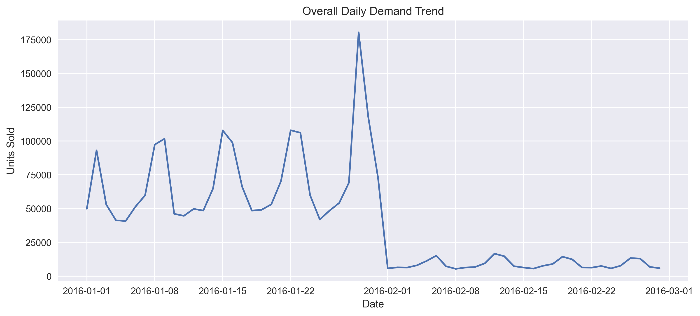

**Monthly Demand Trend**
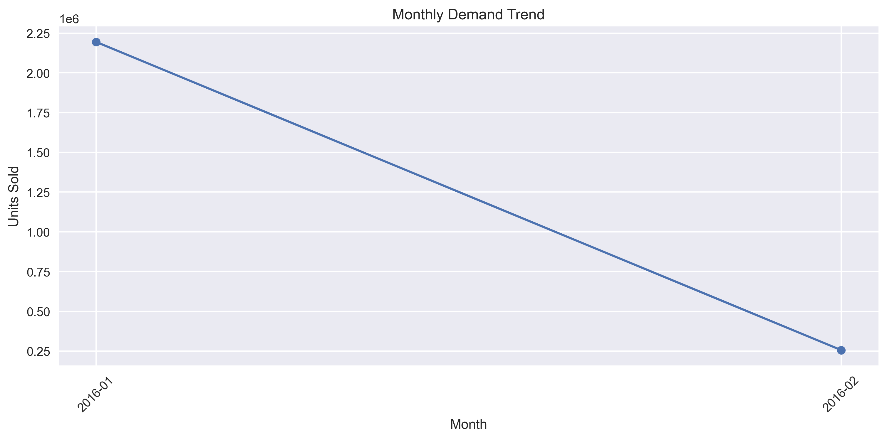

**Rolling Average Forecast**
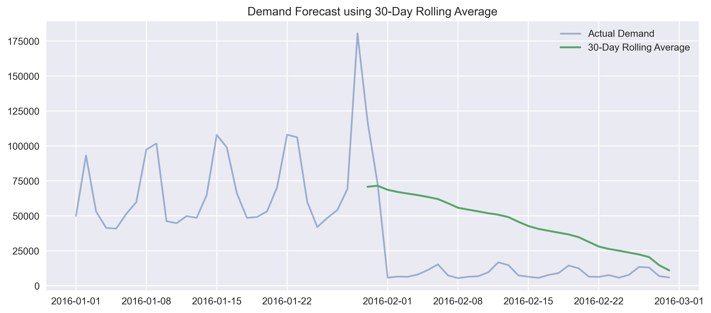

📌 *Outcome:* Enables forecast-based purchasing and stock planning.

---

### 2️⃣ ABC Analysis (Pareto Principle)

Classified products into **A, B, and C categories** based on revenue contribution.

**ABC Pareto Chart**
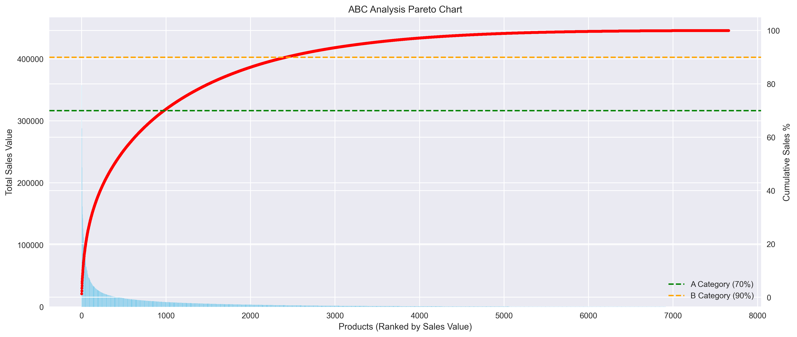

**Sales Contribution by Category**
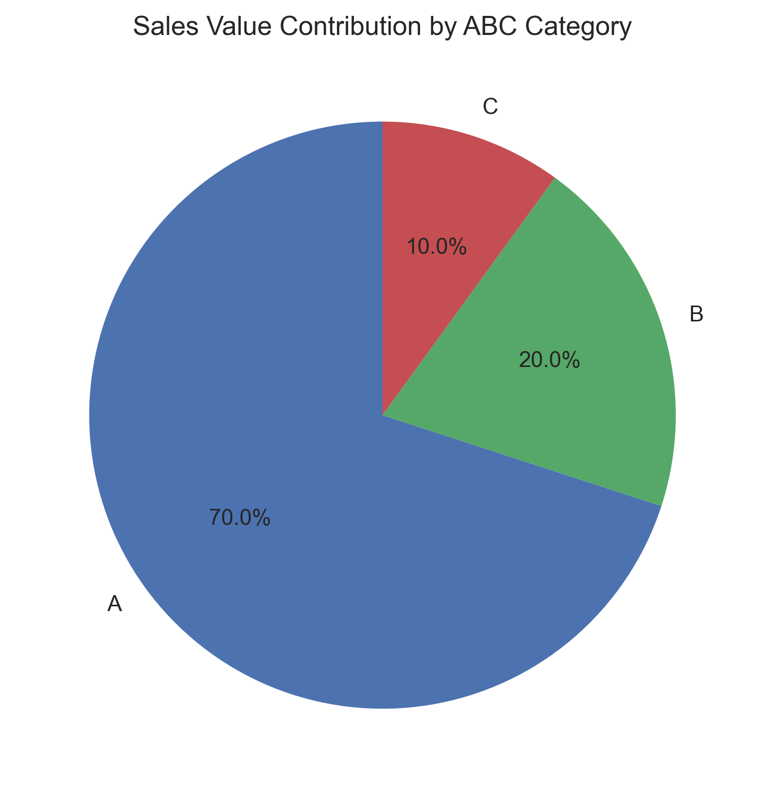

📌 *Outcome:* Helps prioritize high-value inventory and reduce excess stock.

---

### 3️⃣ Inventory Turnover Analysis

Measured how efficiently inventory is sold and replenished.

**Fast-Moving Products**
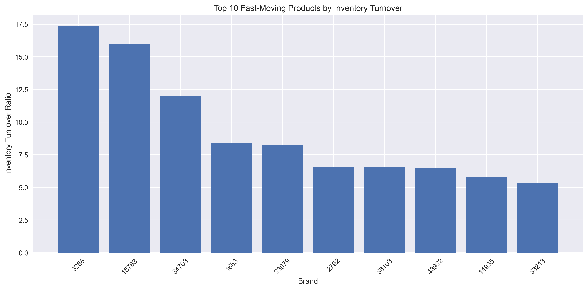

**Slow-Moving Products**
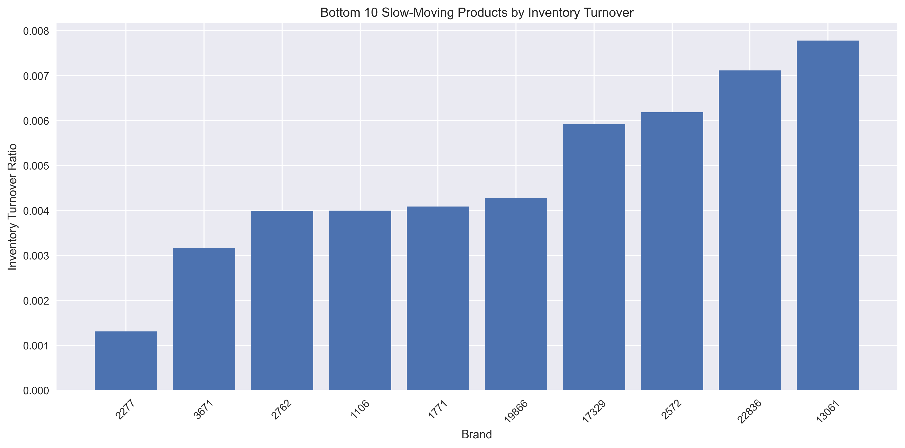

📌 *Outcome:* Identifies obsolete stock and improves working capital efficiency.

---

### 4️⃣ EOQ & Reorder Point Analysis

Optimized order quantities and replenishment timing.

**Economic Order Quantity**
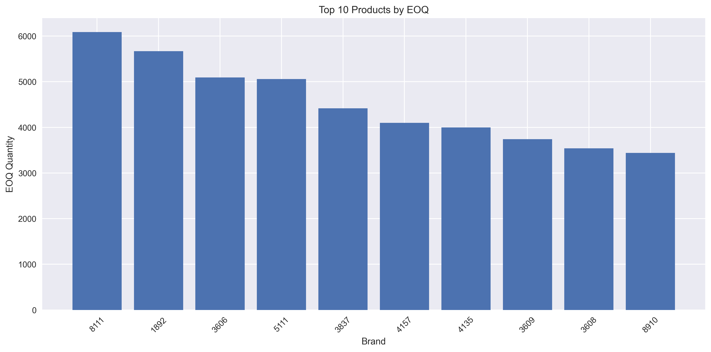

**Reorder Point**
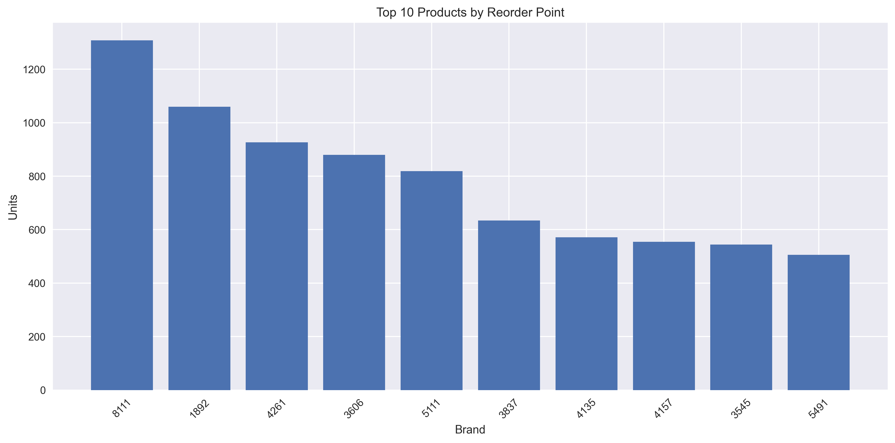

📌 *Outcome:* Minimizes ordering and carrying costs while preventing stockouts.

---

### 5️⃣ Lead Time & Procurement Analysis

Evaluated supplier performance and procurement delays.

**Vendor Lead Time**
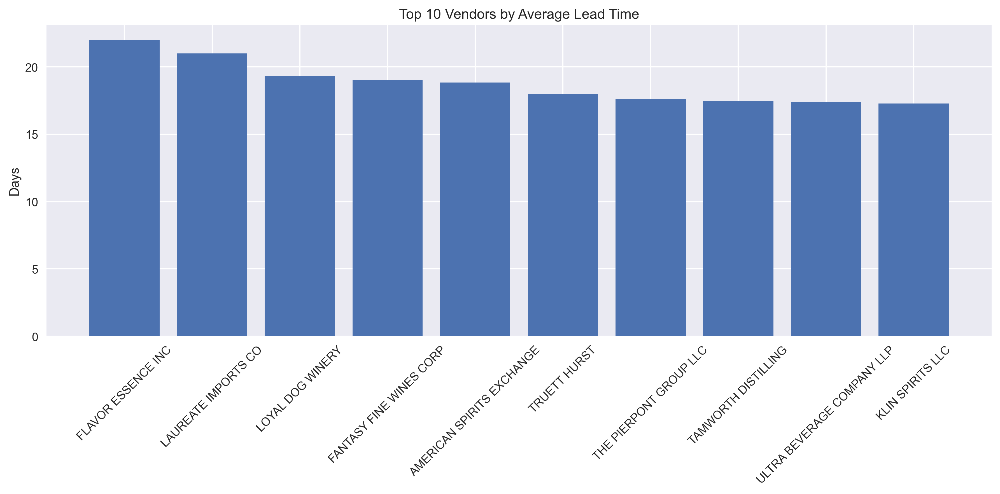

**Payment Delay Analysis**
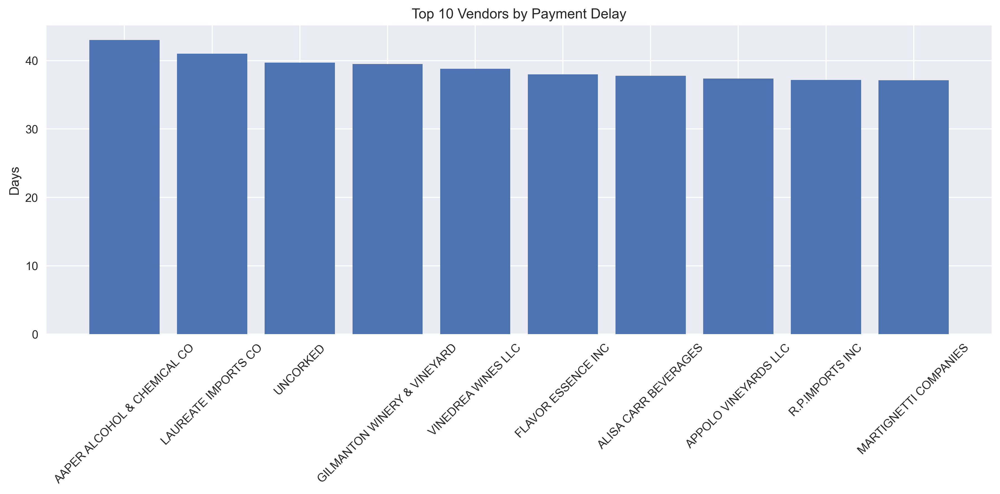

📌 *Outcome:* Supports supplier optimization and negotiation strategies.

---

### 6️⃣ Carrying Cost Analysis

Calculated annual holding costs to identify cost-intensive inventory.

**Top Carrying Cost Items**
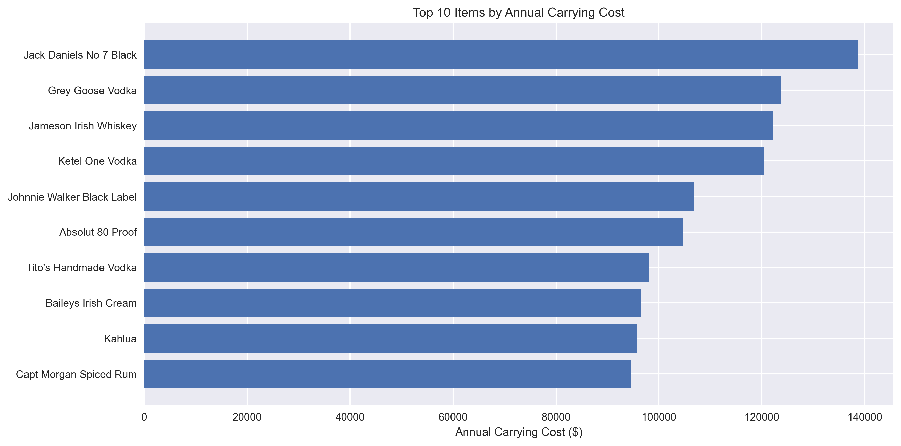

📌 *Outcome:* Encourages lean inventory practices.

---

### 7️⃣ Process Improvement Analysis

Identified procurement bottlenecks and inefficiencies.

**Procurement Bottlenecks**
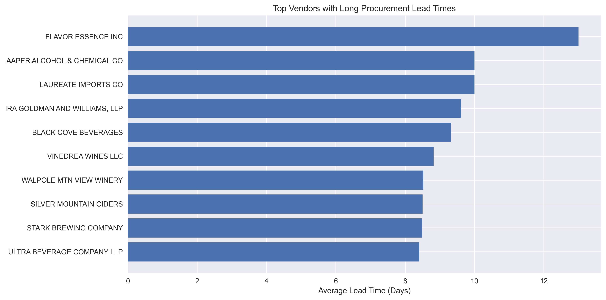

📌 *Outcome:* Improves procurement cycle time and operational efficiency.

---

## 📦 Inventory Management Strategy

- **ABC-based inventory control**
- **Demand-driven replenishment**
- **EOQ & Reorder Point automation**
- **Supplier lead-time optimization**
- **Regular inventory turnover review**

---

## ✅ Final Recommendations

- Reduce excess stock of low-value items
- Focus capital on high-value, fast-moving products
- Implement automated reorder alerts
- Optimize vendor selection based on lead time
- Conduct periodic inventory performance reviews

---

## 🏁 Conclusion

This project demonstrates how **data-driven inventory analytics** can significantly improve:

- Cost efficiency  
- Inventory availability  
- Working capital utilization  
- Supplier performance  

The proposed inventory strategy enables **scalable, sustainable, and optimized inventory management**.

---

## 📄 Project Report

📘 **Detailed Analysis & Insights:**  
➡️ *Inventory Data Analysis Report.pdf*

---

## 🧑‍💻 Author

**👤 Harsh Belekar**  
📍 Data Analyst | Python Developer | SQL | Power BI | Excel | Data Visualization  
📬 [LinkedIn](https://www.linkedin.com/in/harshbelekar) | 🔗[GitHub](https://github.com/Harsh-Belekar)

📧 [harshbelekar74@gmail.com](mailto:harshbelekar74@gmail.com)

---

⭐ *If you found this project helpful, feel free to star the repo and connect with me for collaboration!*
